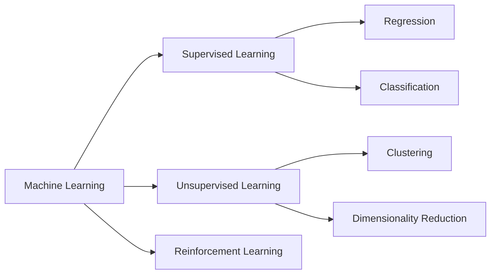

# Introduction to Machine Learning

Machine Learning is a rapidly growing field in computer science that focuses on the development of algorithms and models that can learn from and make predictions on data. In this lecture, we will cover the basics of machine learning, including its applications, types of learning, and common algorithms.

# What is Machine Learning?

Machine Learning (ML) is a subset of Artificial Intelligence (AI) that deals with the ability of a system to learn from data and improve its performance over time. The main goal of ML is to create models that can automatically learn patterns and relationships from data without being explicitly programmed.

 

## And what about Deep Learning ?

Deep learning is a subfield of Machine learning (when you heard about Neural network, it involves deep learning)
one key difference between machine learning and deep learning is the level of abstraction involved in the feature 
extraction process. In machine learning, features are typically manually extracted from the data and then used as inputs
to the model. In deep learning, the model learns to extract the relevant features automatically, 
as part of the training process.

!!! question
    
    **What is feature extraction ?** 

    Feature extraction is the process of selecting and transforming raw data into a set of features that can be used to 
    represent the data in a more meaningful way for a machine learning model. In machine learning, features are 
    essentially the measurable properties of the data that are used to make predictions or decisions.

## Why it became so popular only around 2010?
Machine learning has been around since the mid-20th century, but it wasn't until around 2010 that it became widely 
popular. There are several reasons why this happened:

* Big Data: The explosion of digital data in the 21st century has made it possible to train and test machine learning 
models on massive amounts of data. This has made it easier to develop accurate models that can handle complex tasks.

* Advances in computing power: The development of powerful computers and the availability of cloud computing resources 
have made it possible to process and analyze large amounts of data quickly and efficiently.

* Open-source software: The availability of open-source software frameworks like TensorFlow, PyTorch, and Scikit-learn 
has made it easier for developers to experiment with machine learning algorithms and develop applications.

* Increased awareness: The growth of social media and the internet has led to increased awareness of the potential 
applications of machine learning, and its ability to solve complex problems.

## Example applications of Machine Learning

Machine Learning is being used in various applications across different industries. Some of the popular applications include:

* Image and Speech Recognition
* Natural Language Processing
* Fraud Detection
* Recommender Systems
* Predictive Maintenance
* Autonomous Vehicles

# Types of Machine Learning

**There are three main types of Machine Learning : **

## Supervised Learning
In supervised learning, the model is trained on labeled data (input-output pairs). The goal is to learn a mapping function that can predict the output for new input data. Popular algorithms include Linear Regression, Logistic Regression, Decision Trees, Random Forests, and Neural Networks.

## Unsupervised Learning
In unsupervised learning, the model is trained on unlabeled data. The goal is to learn the underlying structure of the data and identify patterns and relationships. Popular algorithms include Clustering, Principal Component Analysis (PCA), and Association Rule Learning.

## Reinforcement Learning
In reinforcement learning, the model learns by interacting with the environment and receiving feedback in the form of rewards or punishments. The goal is to learn a policy that maximizes the cumulative reward over time. Popular algorithms include Q-Learning, SARSA, and Deep Reinforcement Learning.

### Some examples foreach category

#### Supervised Learning:
Here are some examples of applications of supervised learning:

* Spam detection: In email filtering, the algorithm is trained on labeled data to classify emails as spam or not spam.
 
* Image recognition: In image classification, the algorithm is trained on labeled images to identify objects within images, such as people or animals.
{ align=left }

  
!!! information "Data labeling information"

    Maybe you know it, but when you're doing a captcha... you're labelling image
    
    

    Facebook's photo tagging system is one example of how the company uses machine learning to identify faces in photos 
    and suggest tags to users. When users tag their friends in photos, it helps Facebook's algorithms learn and improve 
    their ability to identify faces and make more accurate suggestions in the future.
    
    Similarly, Twitter uses hashtags to train their algorithms. When users include hashtags in their tweets, 
    it helps Twitter's machine learning algorithms understand the context and topics being discussed. 
    This enables Twitter to make better recommendations to users about who to follow, what content to engage with, 
    and which ads to display.

 

* Object detection is a computer vision task that involves identifying and localizing objects within an image or video.
It is a more complex task than image classification because it not only requires identifying what objects are present in an image, but also where they are located within the image.
Object detection algorithms are typically trained on labeled images that provide both the class label 
(e.g. "person", "car", "tree", etc.) and the bounding box coordinates of each object in the image. 

* Fraud detection: In financial fraud detection, the algorithm is trained on labeled data to identify fraudulent transactions.

#### Unsupervised Learning:
Here are some examples of applications of unsupervised learning:

* Customer segmentation: In marketing, unsupervised learning can be used to segment customers into groups based on similar behavior or characteristics.
* Anomaly detection: In cybersecurity, unsupervised learning can be used to identify unusual network activity or behavior that may be indicative of a security breach.
* Topic modeling: In natural language processing, unsupervised learning can be used to identify topics within a corpus of text documents.

#### Reinforcement Learning:
Here are some examples of applications of reinforcement learning:

* Game playing: Reinforcement learning has been used to develop game-playing agents that can beat human experts at games such as chess and Go.
* Robotics: Reinforcement learning can be used to train robots to perform tasks such as grasping and manipulation of objects.
* Autonomous driving: Reinforcement learning can be used to train self-driving cars to navigate complex traffic scenarios.

## Common Machine Learning Algorithms

There are various algorithms used in Machine Learning, some of which include:

| Algorithm                          | Category |
|------------------------------------| --- |
| Linear Regression                  | Supervised Learning |
| Logistic Regression                | Supervised Learning |
| Decision Trees                     | Supervised Learning |
| Random Forest                      | Supervised Learning |
| Support Vector Machines (SVM)      | Supervised Learning |
| k-Nearest Neighbors (k-NN)         | Supervised Learning |
| Naive Bayes                        | Supervised Learning |
| K-Means                            | Unsupervised Learning |
| Hierarchical Clustering            | Unsupervised Learning |
| Principal Component Analysis (PCA) | Unsupervised Learning |
| Apriori                            | Unsupervised Learning |
| QLearning                          | Reinforcement Learning |

!!! note

    This list contains only some of the common algorithm you'll met

## Some history

## Conclusion

In conclusion, Machine Learning is an exciting field that has numerous applications and is rapidly growing. In this lecture, we have covered the basics of Machine Learning, including its applications, types of learning, and common algorithms. In the following lectures, we will dive deeper into each of these topics and learn how to apply them in real-world scenarios.

