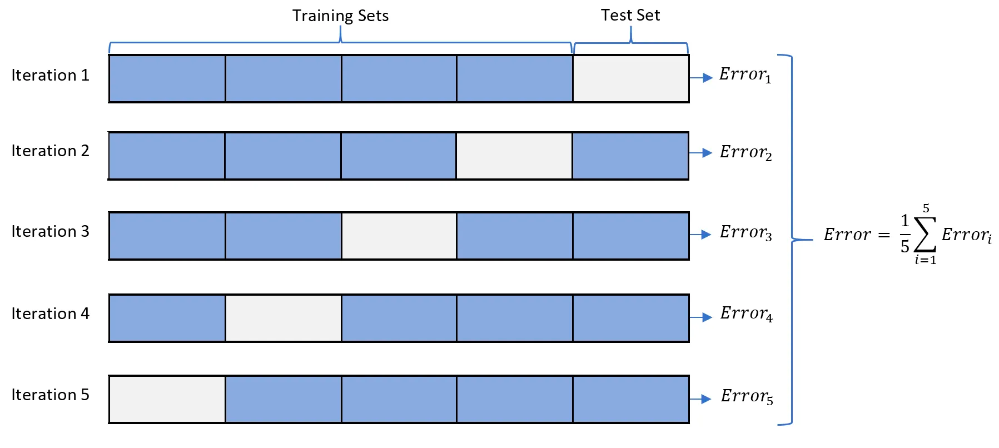

# K-Nearest-neighbor (KNN)

K-nearest neighbors is a type of machine learning algorithm that can be used for both `regression` and `classification` 
problems. The algorithm works by finding the `K` number of training examples that are closest to the new data point, 
and then using the labels of those examples to make a prediction for the new data point.

!!! example "Classification with KNN"

    

!!! question "What is "K" ?"

The "K" in K-nearest neighbors refers to the number of neighbors that the algorithm uses to make its prediction. 
For example, if K=3, then the algorithm will find the three training examples that are closest to the new data point,
and use the labels of those examples to predict the label of the new data point.

!!! question "How does KNN works?"
The algorithm determines which training examples are closest to the new data point by calculating the distance between 
the new data point and each of the training examples in the feature space. The most common distance metric used is 
`Euclidean distance`, but other distance metrics can be used as well.

Once the K nearest neighbors have been identified, the algorithm will use those neighbors to make a prediction for the 
new data point. If the problem is a classification problem, the algorithm will use the mode (most common) label of the 
K neighbors as the predicted label for the new data point. If the problem is a regression problem, the algorithm will 
use the mean or median of the K neighbors as the predicted value for the new data point.

!!! question "Is the value of K important ?"
It's worth noting that the choice of K can have a significant impact on the performance of the algorithm. A small value 
of K (e.g., K=1) can lead to overfitting, where the algorithm memorizes the training data and doesn't generalize
well to new data. A large value of K (e.g., K=n, where n is the number of training examples) can lead to underfitting,
where the algorithm doesn't capture the underlying structure of the data.

Overall, K-nearest neighbors is a simple and effective machine learning algorithm that can be used for a variety of 
problems. However, it can be sensitive to the choice of distance metric and the value of K, and may not perform as well 
as other more sophisticated algorithms for certain types of data.

## Type of distance
| Distance Metric | Formula | Description |
|---|---|---|
| Euclidean distance | $\sqrt{\sum_{i=1}^{n}(x_i - y_i)^2}$ | Measures the straight-line distance between two points in a feature space. |
| Manhattan distance | $\sum_{i=1}^{n}\lvert x_i - y_i \rvert$ | Measures the sum of the absolute differences between the coordinates of two points in a feature space. |
| Minkowski distance (p=3) | $\sqrt[3]{\sum_{i=1}^{n}(x_i - y_i)^3}$ | A generalization of both Euclidean distance and Manhattan distance that can be used for any value of p. |
| Cosine similarity | $\frac{\sum_{i=1}^{n}(x_i \times y_i)}{\sqrt{\sum_{i=1}^{n}x_i^2} \times \sqrt{\sum_{i=1}^{n}y_i^2}}$ | Measures the cosine of the angle between two vectors in a feature space, which is commonly used for text classification and recommendation systems. |
| Hamming distance | $\sum_{i=1}^{n}[x_i \neq y_i]$ | Measures the number of positions at which two binary strings differ, which is commonly used for string matching and error correction. |

