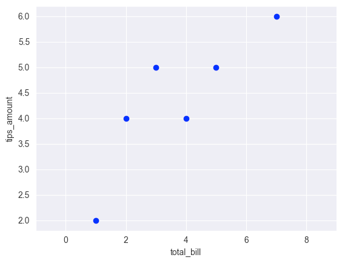
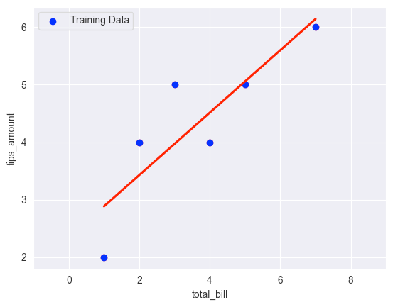
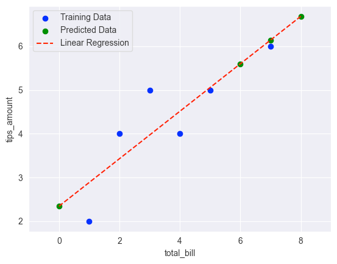

## Simple linear regression

!!! question "What is a simple linear regression?"

    Simple linear regression is a statistical method used to model the relationship between two variables, 
    where one variable (the independent variable) is used to predict the other variable (the dependent variable). 
    The goal of simple linear regression is to find a line of best fit that summarizes the relationship between the two 
    variables. In other words, we want to find the equation of a line that comes as close as possible to passing through 
    all of the data points in the scatter plot of the two variables.

## Let's start by an example
### Input data
Assuming we have a dataset which represents the given tips depending on the amount of the bill
!!! info 

    We already know some data

!!! info 

    From this data, we can find `y = mx + b` that "best fit" the points

!!! info 
    
    Now we can predict `tips_amount` given `total_bill`

The equation for a straight line is given by:

$$
{y = mx + b}
$$

Where :

* y is the dependent variable 
* x is the independent variable
* m is the slope of the line
* b is the y-intercept (i.e., the value of y when x is zero).

!!! question "How to find the values of m and b?" 

    In simple linear regression, we use the method of least squares to find the values of `m` and `b` that minimize the 
    sum of the squared differences between the observed values of `y` and the predicted values of `y` 
    (i.e., the values of y predicted by the line of best fit).

The least squares method involves the following steps:

* Compute the mean of the independent variable x and the mean of the dependent variable y.
* Compute the slope of the line of best fit m using the formula: 

    `m = sum((xi - x_mean) * (yi - y_mean)) / sum((xi - x_mean)^2)`

    Where : 
  
      * xi and yi are the values of the independent and dependent variables, respectively 
      * x_mean and y_mean are their respective means.

 

* Compute the y-intercept b using the formula:

    `b = y_mean - m * x_mean`

Once we have computed the values of m and b, we can use the equation `y = mx + b` to predict the value of y for any 
given value of x.

In the case of multiple linear regression, where there are multiple independent variables, the computation is a bit more
complicated, but the basic idea is the same: we want to find the equation of a hyperplane that comes as close as 
possible to passing through all of the data points in the scatter plot of the independent and dependent variables. 
The method of least squares is also used to find the values of the coefficients (i.e., the slopes) of the hyperplane 
that minimize the sum of the squared differences between the observed values of y and the predicted values of y.

## Implementation example with Sklearn
