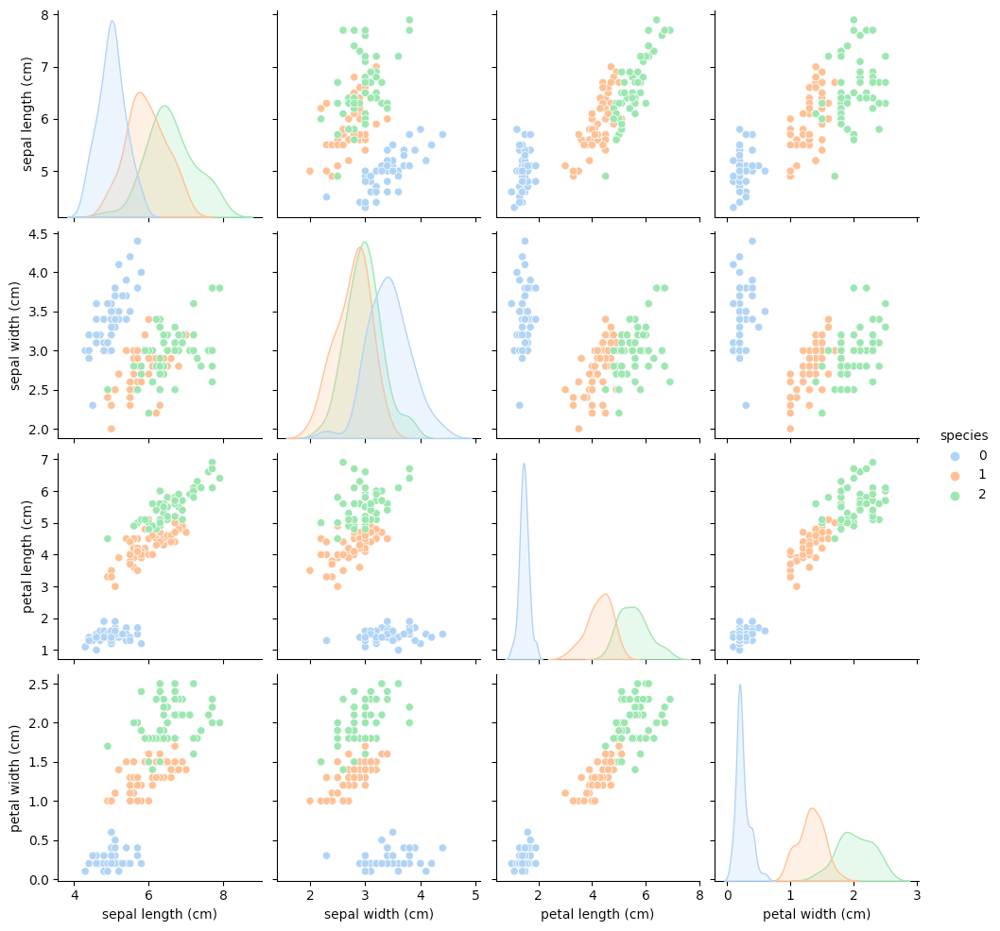

# Logistic regression

!!! question "What is a logistic regression"

    Logistic regression is a statistical method used for modeling the relationship between a binary dependent variable 
    (also known as the response or outcome variable) and one or more independent variables (also known as predictors 
    or explanatory variables). **The goal of logistic regression is to predict the probability of the binary outcome 
    based on the values of the predictors**.
    

The dependent variable in logistic regression is typically binary (e.g., yes/no, 1/0, success/failure), although it can also be ordinal or nominal. The independent variables can be continuous, categorical, or a combination of both.
    
The logistic regression model estimates the log odds (logit) of the binary outcome as a linear combination of the independent variables. The logit is then transformed into a probability using the logistic function, which produces a value between 0 and 1. This probability represents the predicted likelihood of the binary outcome given the values of the independent variables.
    
Logistic regression is often used in classification tasks, such as predicting whether a customer will churn or not, whether an email is spam or not, or whether a patient will respond to a particular treatment or not. It can also be used for understanding the relationship between variables and exploring the effects of different factors on the binary outcome.

!!! info "The math behind"

    The mathematical foundation of logistic regression is based on the logistic function, which is a type of sigmoid 
    function. The logistic function is defined as:

    $$f(z) = 1 / (1 + e^-z)$$
    
    where z is the linear combination of the independent variables and their associated coefficients, or weights.
    In other words, z = b0 + b1x1 + b2x2 + ... + bpxp, where b0 is the intercept or constant term and b1 to bp are the
    coefficients for the independent variables x1 to xp.

## The iris dataset example

The iris dataset is often used for educational purpose in machine learning. 
It contains the following informations : 

|   Column   |                           Description                            |
|:----------:|:-----------------------------------------------------------------:|
|  sepal_length |             Length of sepal (in centimeters)              |
|  sepal_width  |             Width of sepal (in centimeters)               |
| petal_length |             Length of petal (in centimeters)              |
|  petal_width |             Width of petal (in centimeters)               |
|    species   | The species of iris (Setosa, Versicolor, or Virginica) |

!!! tips "Objective"

    Given the four feature sepal_length, sepal_width, petal_length, petal_width, we want to build a model which is able 
    to predict the class (which species) based on new samples -> It's a multi class classification problem

### Let's deep dive a bit in the data
!!! info
    
    The example we will use contains 150 samples

### Now let's solve this classification problem with the Logistic Regression