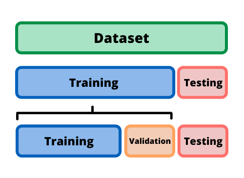

# Model evaluation

## Splitting our data for training, testing, and validation

!!! info

    Train-test-validation is a common approach used in machine learning to evaluate the performance of a model. 
    The approach involves dividing a dataset into three parts: a training set, a validation set, and a test set.

### The training set 
It is the portion of the dataset used to train the model. The model learns from the patterns and 
relationships present in the training data and uses this knowledge to make predictions on new, unseen data.

### The validation set 
It is used to evaluate the performance of the model during training. 
As the model learns from the training data, its performance is evaluated on the validation set to assess whether 
it is overfitting (i.e., memorizing the training data and performing poorly on new data) or underfitting 
(i.e., not capturing the patterns and relationships present in the training data).

### The test set 
!!! tips

    You can think about the test set as `unseen data`

It is used to evaluate the performance of the model after it has been trained and tuned on the training and 
validation sets. The test set provides an unbiased estimate of the model's performance on new, unseen data.

The train-test-validation approach is important because it enables us to assess the quality of the model's predictions
and make informed decisions about how to improve the model. By dividing the dataset into separate training, validation,
and test sets, we can ensure that the model is not overfitting or underfitting and that it can generalize well to new,
unseen data.

### Cross-validation
!!! question "What is cross validation ?"
    
    Cross-validation is a technique used to evaluate the performance of a machine learning model on a limited dataset by 
    splitting the data into multiple subsets, training the model on some subsets, and evaluating its performance on the 
    remaining subsets.

The basic idea behind cross-validation is to ensure that the model is not overfitting the data and can generalize well 
to new data. It does this by simulating the process of testing the model on new data that it has not seen before.

The most common form of cross-validation is k-fold cross-validation, where the data is divided into k equal-sized 
subsets, or folds. The algorithm is then trained on k-1 folds and tested on the remaining fold. This process is 
repeated k times, with each fold used exactly once as the testing data. The results from each fold are then averaged 
to obtain an estimate of the model's performance.

For example, in 5-fold cross-validation, the dataset would be split into five equal parts, with four parts used 
for training and one part used for testing. This process is repeated five times, with each of the five parts used as
the testing data once. The average of the results from the five rounds is then used as an estimate of the model's 
performance.

One of the advantages of cross-validation is that it can provide a more accurate estimate of a model's performance 
than a single train-test split. This is because the results are averaged over multiple rounds, reducing the variability
of the estimate. It can also help to detect overfitting, as a model that overfits the training data will perform poorly
on the testing data.

!!! warning 

    Cross-validation can also be computationally expensive, as it requires training and evaluating the model 
    multiple times. It may also be less appropriate for some datasets, such as those with highly imbalanced classes or 
    temporal dependencies.

Overall, cross-validation is a powerful tool for evaluating the performance of a machine learning model and can help to
improve the accuracy and generalization of the model.

## Classification

!!! tips
    
    In general we use a confusion matrix to visualize the error made by an algorithm in a classification problem
    it's not limited to binary classification.

    |              |  Actual Positive |  Actual Negative |
    |:------------:|:----------------:|:----------------:|
    | Predicted Positive |       TP         |       FP         |
    | Predicted Negative |       FN         |       TN         |

| Evaluation Metric |                   Formula                   | When to Use |
|:-----------------:|:-------------------------------------------:|:-----------:|
|     Accuracy      |           (TP + TN) / (TP + TN + FP + FN)    |  Balanced   |
|     Precision     |                 TP / (TP + FP)              | Imbalanced  |
|       Recall      |                 TP / (TP + FN)              | Imbalanced  |
|      F1 Score     |      2 * (Precision * Recall) / (Precision + Recall) | Imbalanced  |

## Regression
| Evaluation Metric |                         Formula                         |        When to Use        |
|:-----------------:|:-------------------------------------------------------:|:-------------------------:|
|   Mean Squared Error (MSE)  |               1/n * ∑(y_true - y_pred)^2                |          General          |
| Root Mean Squared Error (RMSE) |              √(1/n * ∑(y_true - y_pred)^2)              |          General          |
|       R-squared (R2)       |  1 - ∑(y_true - y_pred)^2 / ∑(y_true - y_true_mean)^2   |          General          |
|        MAE (Mean Absolute Error)         | 1/n * ∑                        (      y_true - y_pred ) |  General    |
|        MAPE (Mean Absolute Percentage Error)       |        100% * 1/n * ∑( y_true - y_pred) / y_true        |   Specific  |

