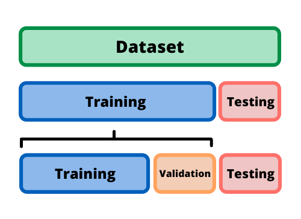

# Model evaluation

## Splitting our data for training, testing, and validation

!!! info

    Train-test-validation is a common approach used in machine learning to evaluate the performance of a model. 
    The approach involves dividing a dataset into three parts: a training set, a validation set, and a test set.

### The training set 
It is the portion of the dataset used to train the model. The model learns from the patterns and 
relationships present in the training data and uses this knowledge to make predictions on new, unseen data.

### The validation set 
It is used to evaluate the performance of the model during training. 
As the model learns from the training data, its performance is evaluated on the validation set to assess whether 
it is overfitting (i.e., memorizing the training data and performing poorly on new data) or underfitting 
(i.e., not capturing the patterns and relationships present in the training data).

### The test set 
!!! tips

    You can think about the test set as `unseen data`

It is used to evaluate the performance of the model after it has been trained and tuned on the training and 
validation sets. The test set provides an unbiased estimate of the model's performance on new, unseen data.

The train-test-validation approach is important because it enables us to assess the quality of the model's predictions
and make informed decisions about how to improve the model. By dividing the dataset into separate training, validation,
and test sets, we can ensure that the model is not overfitting or underfitting and that it can generalize well to new,
unseen data.

## Classification

!!! tips
    
    In general we use a confusion matrix to visualize the error made by an algorithm in a classification problem
    it's not limited to binary classification.

    |              |  Actual Positive |  Actual Negative |
    |:------------:|:----------------:|:----------------:|
    | Predicted Positive |       TP         |       FP         |
    | Predicted Negative |       FN         |       TN         |

| Evaluation Metric |                   Formula                   | When to Use |
|:-----------------:|:-------------------------------------------:|:-----------:|
|     Accuracy      |           (TP + TN) / (TP + TN + FP + FN)    |  Balanced   |
|     Precision     |                 TP / (TP + FP)              | Imbalanced  |
|       Recall      |                 TP / (TP + FN)              | Imbalanced  |
|      F1 Score     |      2 * (Precision * Recall) / (Precision + Recall) | Imbalanced  |

## Regression
| Evaluation Metric |                         Formula                         |        When to Use        |
|:-----------------:|:-------------------------------------------------------:|:-------------------------:|
|   Mean Squared Error (MSE)  |               1/n * ∑(y_true - y_pred)^2                |          General          |
| Root Mean Squared Error (RMSE) |              √(1/n * ∑(y_true - y_pred)^2)              |          General          |
|       R-squared (R2)       |  1 - ∑(y_true - y_pred)^2 / ∑(y_true - y_true_mean)^2   |          General          |
|        MAE (Mean Absolute Error)         | 1/n * ∑                        (      y_true - y_pred ) |  General    |
|        MAPE (Mean Absolute Percentage Error)       |        100% * 1/n * ∑( y_true - y_pred) / y_true        |   Specific  |

