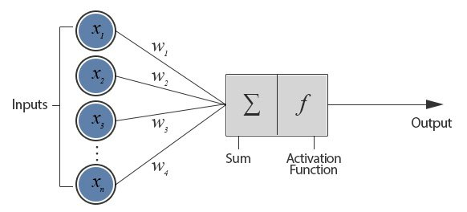
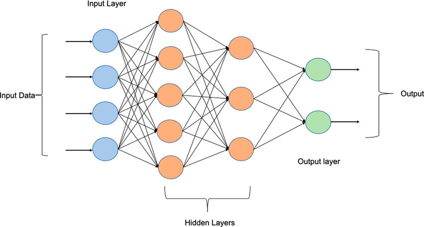
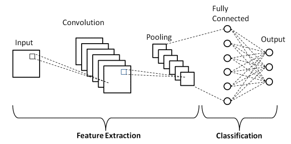
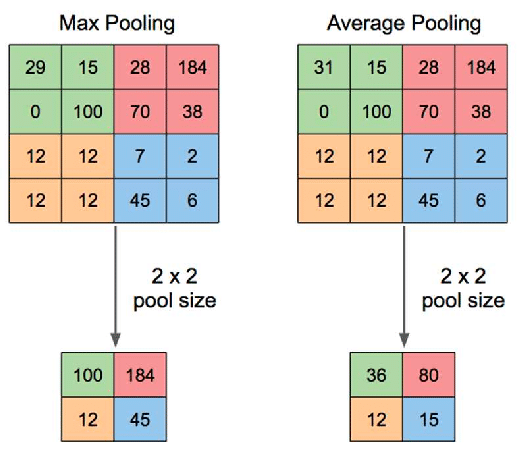
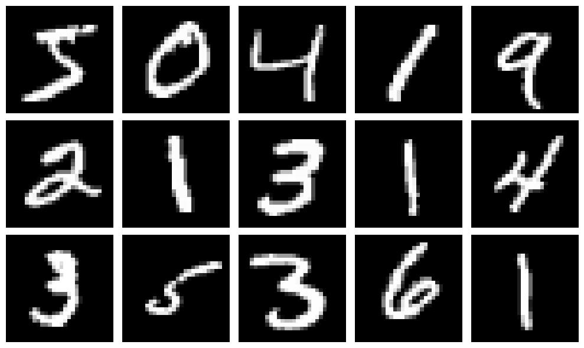
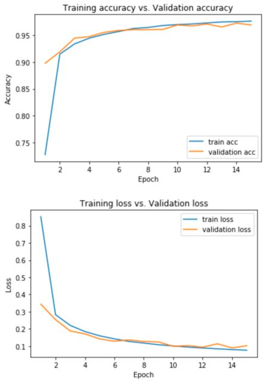

# Neural network

## A simple neural network ... 


Let's introduce the Perceptron ! (Aka single-layer neural  network)

The basic idea behind a perceptron is to take an input vector of features, multiply each feature by a corresponding 
weight, and then sum up these weighted inputs to produce an output. This output is then compared to a threshold value,
and the perceptron outputs a 1 if the output is greater than or equal to the threshold, or a 0 if the output is less
than the threshold.

The weights in a perceptron are initially set to random values, and the perceptron is trained using a supervised
learning algorithm called the perceptron learning rule. In this algorithm, the perceptron is presented with a training
example, and if the perceptron's output is correct, no changes are made to the weights.
If the output is incorrect, the weights are adjusted to bring the output closer to the correct value.

!!! warning

    One important limitation of perceptrons is that they are only able to classify linearly separable data, meaning data that can be separated into two categories by a straight line or hyperplane. This limitation was addressed by the development of more complex neural network architectures, such as **multi-layer** perceptrons, that can handle non-linearly separable data.

## Basic Architecture of a Multi-layer perceptron



### Input layer
The input layer is the first layer in a neural network and is responsible for receiving the input data. The input layer
consists of neurons that correspond to the input features of the data. For example, if the input data has 10 features,
then the input layer will have 10 neurons, with each neuron representing one input feature.


### Hidden layer
The hidden layer is a layer of neurons that lies between the input layer and the output layer. The hidden layer 
processes the input data and performs computations to transform the data into a more meaningful representation.
The number of hidden layers in a neural network can vary depending on the complexity of the problem being solved.

### Output layer
The output layer is the final layer in a neural network and is responsible for producing the output of the model.
The output layer consists of neurons that correspond to the target variables of the data. For example, if the task is to
classify images of dogs and cats, the output layer will have 2 neurons, with each neuron representing one of the classes.

## Different types of neural network
In this course, we will cover two types of neural network, however many architectures exists.

!!! info 
    Most of the architectures are used for specific uses cases. 


### Feedforward neural network
!!! tip

    This is the architecture we have seen previously
This is the most basic type of neural network, also known as a **multi-layer perceptron**.
It consists of an input layer, one or more hidden layers, and an output layer. The data flows from the input layer to 
the output layer through the hidden layers. It is commonly used for classification and regression problems.

### Convolutional neural network
CNN is a specialized type of neural network that is designed for **processing and analyzing images** and videos. 
It uses convolutional layers to detect features in the input data and pooling layers to reduce the size of the output.
It is commonly used for image and video recognition tasks.

### Recurrent neural network
RNN is a type of neural network that is designed for processing sequential data, 
such as time series data or natural language processing. It uses loops to process the input data and store information
in its memory. It is commonly used for **language modeling, speech recognition, and sentiment analysis**.

### Long shot-term memory 
LSTM is a type of RNN that is designed for processing long-term dependencies.
It uses memory cells and gates to store and control the flow of information in the network. It is commonly used for
**natural language processing and speech recognition tasks**.


!!! info
    
    For information GPT chat or BERT use a Transformer architecture

## How does neural networks "learn" ?
**It depends on the kind of network** ! In this section, we will discover the "general" methods, applied to some 
specific type of models. 

!!! info 

    As previously mentioned, we will focus on two architectures:
    
    * Fastforward neural network 
    * Convolutional neural network

Neural networks are trained through an **optimization process** that involves adjusting the weights and biases of the 
network to minimize a **loss function** that measures the difference between the predicted output and the actual output.


### The optimization process
> Training a model is just minimizing a cost function (=loss function)
 
The optimization process typically involves the following steps:

* Forward pass: The input data is fed through the network, and the output is computed by applying a set of weights and biases to the input data.

* Compute loss: The difference between the predicted output and the actual output is measured using a loss function, 
such as mean squared error or cross-entropy loss.

* Backward pass: The gradient of the loss function of the network is computed using the **backpropagation algorithm**
(there are other algorithms). 
The gradient measures the direction and magnitude of the change in the loss function that would result from a small 
change in the weights and biases.

* Update weights: The weights and biases are updated in order to minimize the loss function : using **the gradient descent**

 
!!! tip 
    
    The process of forward pass, compute loss, backward pass, and update weights is repeated for multiple iterations 
    until the loss function converges to a minimum. Each iteration is called an **epoch**.

````mermaid
graph LR
A(Input Data) --> B(Forward Pass)
B --> C(Compute Loss)
C --> D(Backward Pass)
D --> E(Update Weights)
E --> B

````

## Zoom on Convolutional neural network

!!! tip

    CNN is a type of model that is commonly used for image recognition, object detection, and other computer vision tasks.

The key feature of CNNs is their ability to automatically learn features from raw input data, such as images, 
by applying a series of convolutional layers. In these layers, the network applies a set of filters (also called kernels)
to the input image to extract certain features, such as edges or shapes, that are relevant to the task at hand.


### You said convolution ?
Convolution is a fundamental operation in image processing that involves applying a filter to an image to produce a new
filtered image. The filter, also known as a kernel, is a matrix of values that is applied to each pixel in the 
input image.


Each filter is applied to a small patch of the input image, and the dot product between the filter and the patch is 
computed to produce a single output value. This output value is placed in a new **feature map**, at the same location 
as the center of the patch in the input image. This process is repeated for every possible patch in the image.

These features are then passed through additional layers such as pooling, activation, and fully connected layers to 
classify the image or perform other relevant tasks.




### Layers explanations

#### Pooling layer

!!! tip

    The aim of this layer is tu reduce spatial dimension !

The pooling layer is typically added after a convolutional layer in a CNN. Its purpose is to reduce the spatial 
dimensions of the output feature maps produced by the convolutional layer while retaining the important features.
This helps to reduce the number of parameters in the model and control overfitting. Max-pooling and average-pooling 
are the most common types of pooling operations.



> Max & Average pooling illustration


#### Activation layer

!!! tip 

    It introduice non-linearity !

The activation layer introduces non-linearity into the model by applying a non-linear function to the output of a 
convolutional or pooling layer. The most commonly used activation function is the Rectified Linear Unit (ReLU),
which sets any negative values to zero and leaves positive values unchanged. Other activation functions include sigmoid,
tanh, and softmax.


#### Fully connected layer

!!! tip
    
    The layer responsible of classifying ! 


The fully connected layer is the final layer in a CNN and its purpose is to classify the image. The output of the 
previous layer is flattened into a vector and fed into a fully connected layer, where each neuron in the layer is 
connected to every neuron in the previous layer. The fully connected layer applies a weight to each input and passes 
the output through an activation function to produce a class score. The most commonly used activation function in the 
final layer is the softmax function, which converts the class scores into a probability distribution over the different 
classes.

!!! info

    In object detection, the fully connected layer may produce a set of bounding boxes and class scores for each object,
    while in semantic segmentation, the fully connected layer may produce a dense output tensor with the same dimensions
    as the input image.


### CNN in action - Image classification

!!! info
    
    For this example, we will use the mnist digit dataset (a dataset containing handwritten digit) - aka the hello 
    world of image classification 


#### Import the necessary libraries

```python
import numpy as np
import matplotlib.pyplot as plt
from tensorflow import keras
from tensorflow.keras import layers
```

#### Import the data
!!! warning 

    In a real life example, you'll read the data from your local system or any storage.

```python
(x_train, y_train), (x_test, y_test) = keras.datasets.mnist.load_data()
```

#### Visualize some samples

````python
fig, axes = plt.subplots(nrows=3, ncols=5, figsize=(10, 6))
axes = axes.flatten()
for i in range(len(axes)):
    axes[i].imshow(x_train[i], cmap='gray')
    axes[i].axis('off')
plt.tight_layout()
plt.show()
````


#### Prepare the data
```python
num_classes = 10
input_shape = (28, 28, 1)

# Load the data and split it between train and test sets
(x_train, y_train), (x_test, y_test) = keras.datasets.mnist.load_data()

# Scale images to the [0, 1] range
x_train = x_train.astype("float32") / 255
x_test = x_test.astype("float32") / 255
# Make sure images have shape (28, 28, 1)
x_train = np.expand_dims(x_train, -1)
x_test = np.expand_dims(x_test, -1)
print("x_train shape:", x_train.shape)
print(x_train.shape[0], "train samples")
print(x_test.shape[0], "test samples")


# convert class vectors to binary class matrices
y_train = keras.utils.to_categorical(y_train, num_classes)
y_test = keras.utils.to_categorical(y_test, num_classes)
```

!!! tip

    Here we're rescaling the image to range [0;1] because most activation functions used in neural networks 
    (such as ReLU activation) have the most sensitivity around zero and tend to saturate as their input gets larger. 
    By scaling the input images to a smaller range (such as [0, 1]), we ensure that the activation functions operate in
    their most sensitive regions, which can improve the overall performance of the model.


#### Create the model

```python
model = keras.Sequential(
    [
        keras.Input(shape=input_shape),
        layers.Conv2D(32, kernel_size=(3, 3), activation="relu"),
        layers.MaxPooling2D(pool_size=(2, 2)),
        layers.Conv2D(64, kernel_size=(3, 3), activation="relu"),
        layers.MaxPooling2D(pool_size=(2, 2)),
        layers.Flatten(),
        layers.Dropout(0.5),
        layers.Dense(num_classes, activation="softmax"),
    ]
)
model.summary()
```

!!! question "Ok but why these values?"
    
    Each filter in a Conv2D layer is responsible for detecting a specific feature or pattern in the input image, 
    and increasing the number of filters can help to capture a wider range of features. In the given model, the first
    Conv2D layer has 32 filters and captures basic features such as edges and corners, while the second Conv2D layer 
    with 64 filters captures more complex features such as shapes and textures.

    Reducing the kernel size in the second Conv2D layer can help to capture smaller details in the input image.
    The kernel size determines the receptive field of each filter in the Conv2D layer, and reducing the kernel size can
    increase the granularity of the features that are detected. In the given model, the first Conv2D layer has a kernel
    size of (3, 3), which captures larger patterns in the input image, while the second Conv2D layer with a smaller
    kernel size of (2, 2) captures smaller details.

#### Train the model
```python
batch_size = 128
epochs = 15

model.compile(loss="categorical_crossentropy", optimizer="adam", metrics=["accuracy"])

model.fit(x_train, y_train, batch_size=batch_size, epochs=epochs, validation_split=0.1)
```

!!! warning

    At that point, you should monitor the performance of your model as for any other model we have previously seen.
    It's common to visualize the accuracy / loss on train and validation set.
    Also, you can provide the confusion matrix, and check other metrics like recall, F1-score, depending on the problem.




!!! tip

    kernel size, pool size, number of epoche, the type of optimizer ... They are all hyperparameters that you can tuned 
    when training your model ! 

Let's practice !