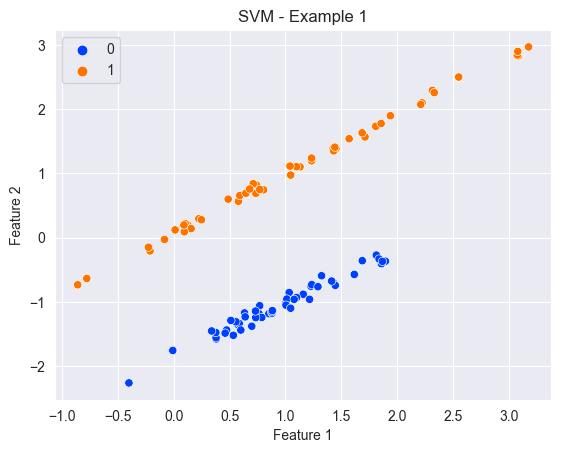
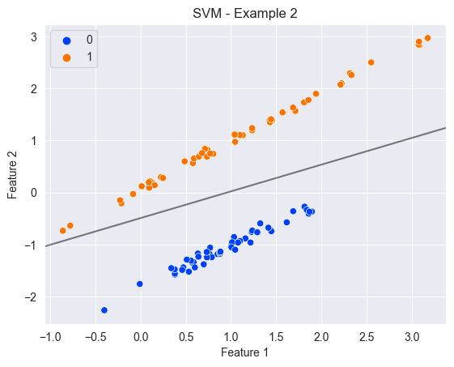
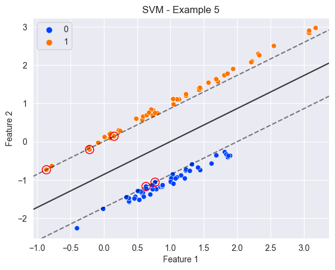
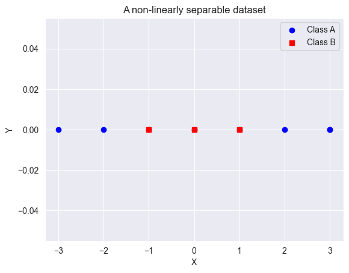
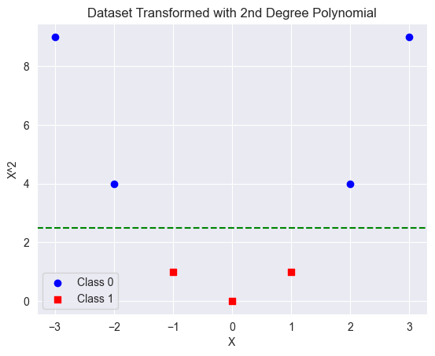
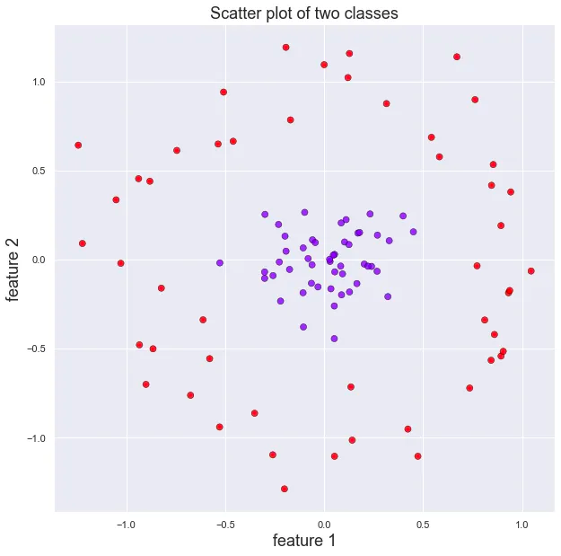
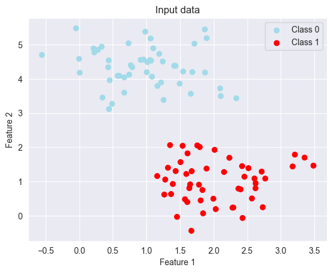
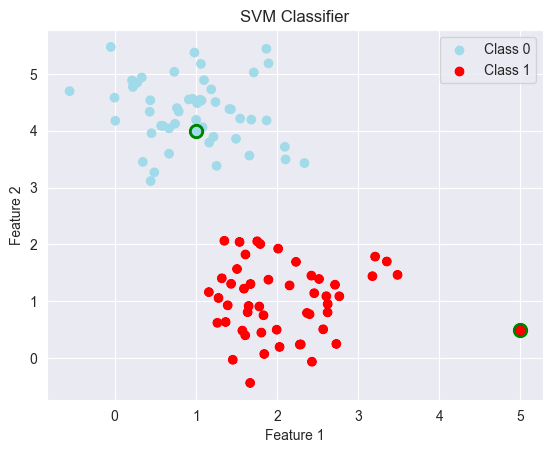

# SVM
Support Vector machines (SVMs) are a type of machine learning algorithm used for both classification and regression.

The basic concept behind SVM is to find the best possible boundary or hyperplane that separates the data points into 
different classes (for a classification problem).


## How does it work ? 

### Linear problems

Let's start with an example

Assuming we've the following data, which represents a two-dimensional binary problem: 




It's super easy to draw a hyperplane that separate the data...

A working hyperplane     |  A better hyperplane
:-----------------------:|:-------------------------:
 |  

!!! question
    
    But how to choose the 'best'? hyperplane


The hyperplane is chosen such that the margin or distance between the hyperplane and the closest 
data points from each class is maximized.

> In a Support Vector Machine algorithm, the margins are the boundaries between the support vectors 
(the closest points to the decision boundary) and the rest of the data points

A working hyperplane     |  A better hyperplane
:-----------------------:|:-------------------------:
 |  


!!! info

    When no points are allowed to cross the margins, we are speaking about `hard margin classifier` (right figure).
    **This only works when the data is linearly separable**, which is not the case in many problems. On the contrary, 
    we are talking about `soft margin classifier` (left figure).

    Soft margin allows some data points to be misclassified by the hyperplane, but only by a certain amount,
    which is controlled by a parameter called C (in `scikit-learn`). The larger the value of C, the more strict the margin becomes, meaning
    fewer data points are allowed to be misclassified. Conversely, a smaller value of C allows more misclassified data 
    points but can lead to a larger margin.

    The advantage of soft margin is that it can handle more complex datasets that are not linearly separable. By 
    allowing some margin of error, the SVM algorithm can still find a hyperplane that separates the classes as well as 
    possible. However, the choice of the value of C is important, as it can affect the performance of the algorithm 
    on different datasets.
    
    > C is an hyperparameter
### Non-linear problems
Let's take a simple dataset... which is non-linearly separable.

!!! question

    How to find the hyperplan that separate the two classes ?


> Here, we are dealing with a 1 feature (X) dataset

### Making a dataset linearly separable
One approach to make a non-linearly separable data set, into a separable one is to create additional features derived 
from the original one. In our example, it means we will transform one feature, to two features.
In other words, we are increasing the dimensionality of the feature space.

!!! warning 

    By increasing the dimensionality of the feature space, we are introducing some additional computations.
    It can be a problem on large datasets.


#### Polynomial features


Now, it's really easy to find the hyperplane that separate the two classes
<br><br>
#### Radial basis function
Let's take another example, a dataset which contains two features :

> Credit to James Thorn

Another approach (very common using SVM) is to use radial basis function to increase dimensionality.
The RBF is defined as:

$$
K(x_i, x_j) = \exp(-\gamma ||x_i - x_j||^2)
$$

By applying this transformation, we're increasing the dimension of our dataset (a third dimension is added).

Let's visualize the result:


!!! info

    We can see that the data is now linearly separable by an horizontal plan, around `r=0.7`


### The kernel
We have previously seen that performing transformations of a feature space to a higher dimension can lead to extensive
computation. What is the solution ? 

**Let's introduce the kernel trick !**

The kernel trick is a technique used to implicitly transform the input data into a higher-dimensional space without 
actually computing the transformed data points. In SVMs, the kernel function is used to transform the input data into a 
higher-dimensional space where the data points may become linearly separable. Instead of explicitly computing the 
transformed data points, the kernel function is used to compute the dot product between pairs of data points in the 
transformed space, without actually computing the transformed data points.

!!! tip 

    SVMs can efficiently work with high-dimensional data, without explicitly computing the transformed data points. 
    This makes SVMs computationally efficient and allows them to handle large amounts of data.


### In practice
Let's take a simple classification example.

> For the example, I will generate some data using sklearn

##### Step 1 - Importing the necessary modules

```python
from sklearn import svm
from sklearn.datasets import make_blobs
import matplotlib.pyplot as plt
```

##### Step 2 - Create fake date (you don't need to remember this)

```python
X, y = make_blobs(n_samples=100, centers=2, random_state=0, cluster_std=0.60)
```

##### Step 3 - Visualize the data
```python
# Plot all the data points
plt.scatter(X[:, 0], X[:, 1], c=[colors[c] for c in y])
plt.xlabel('Feature 1')
plt.ylabel('Feature 2')
plt.title('SVM Classifier')

# Add a legend for the class labels
handles = [plt.scatter([], [], c=colors[c], label='Class {}'.format(c)) for c in colors]
plt.legend(handles=handles)

plt.show()
```




##### Step 3 - Creating an instance of SVM Classifier and fit it to the data

```python
svm_classifier = svm.SVC(kernel='linear', C=1)
svm_classifier.fit(X, y)
```

!!! info

    As you can see, it's very similar to what we have done with other type of models.

##### Step 4 - Make prediction on new data
```python
new_data = [[5.0, 0.5], [1, 4]]
predicted_labels = svm_classifier.predict(new_data)
```

##### Step 5 - Let's visualize our predictions
By adding the following code to our previous visualization code, you can see the new datapoints and their predicted 
labels
```python
for i in range(len(new_data)):
    plt.scatter(new_data[i][0], new_data[i][1], s=80, color=colors[predicted_labels[i]], edgecolors='g', linewidth=2)
```




#### Additional information

As you can see, you can pass multiple parameters to the SVC class:

* `kernel`, default = 'rbf'
* `C`, default = `1`

Those two hyperparameters are particularly important when building an SVM model.
To choose their values, you can perform `parameter tuning`.

To tune these hyperparameters, one approach is to use a grid search, which involves trying out a range of values for 
each parameter and selecting the combination that gives the best performance on a validation set. Another approach is to
use a randomized search, which randomly samples from the hyperparameter space, and again selects the combination that 
gives the best performance on a validation set
