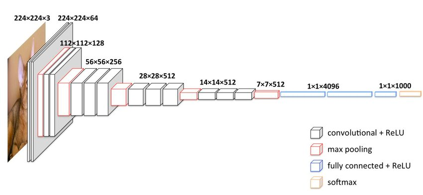

# Transfer-learning

## What is transfer-learning ?

Transfer learning is the process of using "knowledge" gained from training a model on one task to improve the 
performance of a model on a different task.

The pre-trained model used in transfer learning has been trained on a large-scale  dataset, such as ImageNet, to 
recognize a wide range of visual concepts. These pre-trained models are able to learn useful features that can be 
generalized to many tasks, and have proven to be effective at a variety of computer vision tasks such as image 
classification, object detection, and image segmentation.

To apply transfer learning, the pre-trained model is typically modified by adding new layers on top of the existing 
layers. These new layers are then trained on the new dataset to adapt the pre-trained model to the new task. 
The weights of the pre-trained layers may be frozen or fine-tuned during training, depending on the size of the new 
dataset and the similarity of the new task to the original task.


!!! tip

    Transfer learning is a good way to significantly reduces the amount of time, data, and computing resources needed to
    train a new model from scratch.

## When can (should) I use Transfer learning ?

Transfer learning can be used in different scenarios : 

* Small Dataset: When you have a small dataset, transfer learning can help you leverage the pre-trained model's knowledge
and improve your model's accuracy.
* Lack of Compute Resources: Training a deep neural network from scratch can be computationally expensive. 
Transfer learning can help you reduce the time and resources required to train your model.

* Time Constraints: Transfer learning can help you quickly build and train models for specific tasks, such as building 
a proof-of-concept or prototype.

* Similar Tasks: When the new task is related to the original task that the pre-trained model was trained on, transfer 
learning can help you improve your model's performance.

## Attention points
!!! warning

    Transfer learning is not a magic solution!

There are some cases in which transfer learning will not be efficient, for example : 

* Task-Specific Features: If your new task involves features that are specific to that task and not present in the 
pre-trained model
* Data Incompatibility: If the pre-trained model was trained on data that is substantially different from your new task,
such as different image types (if it's trained on high resolution images, and you only have low quality images for 
example).


## How to use transfer learning with keras ? 
Instead of building a model in the "classic" way, you will import an existing model and its weights.

Keras comes with a [module applications](https://keras.io/api/applications/#available-models) which contains the most 
common architectures with pre-trained weights. 

!!! tip

    When choosing a base model, you need to consider its size, the time per inference etc... based on your specific 
    application.

Below you will find some models available with their corresponding caracteristics performance :

| Model              | Size (MB) | Top-1 Accuracy | Top-5 Accuracy | Parameters | Depth | Time (ms) per inference step (CPU) | Time (ms) per inference step (GPU) |
| ------------------ | --------- | -------------- | -------------- | ---------- | ----- | ---------------------------------- | ---------------------------------- |
| Xception           | 88        | 79.0%          | 94.5%          | 22.9M      | 81    | 109.4                              | 8.1                                |
| VGG16              | 528       | 71.3%          | 90.1%          | 138.4M     | 16    | 69.5                               | 4.2                                |
| VGG19              | 549       | 71.3%          | 90.0%          | 143.7M     | 19    | 84.8                               | 4.4                                |
| ResNet50           | 98        | 74.9%          | 92.1%          | 25.6M      | 107   | 58.2                               | 4.6                                |
| ResNet50V2         | 98        | 76.0%          | 93.0%          | 25.6M      | 103   | 45.6                               | 4.4                                |
| ResNet101          | 171       | 76.4%          | 92.8%          | 44.7M      | 209   | 89.6                               | 5.2                                |
| ResNet101V2        | 171       | 77.2%          | 93.8%          | 44.7M      | 205   | 72.7                               | 5.4                                |
| ResNet152          | 232       | 76.6%          | 93.1%          | 60.4M      | 311   | 127.4                              | 6.5                                |
| ResNet152V2        | 232       | 78.0%          | 94.2%          | 60.4M      | 307   | 107.5                              | 6.6                                |
| InceptionV3        | 92        | 77.9%          | 93.7%          | 23.9M      | 189   | 42.2                               | 6.9                                |
| InceptionResNetV2  | 215       | 80.3%          | 95.3%          | 55.9M      | 449   | 130.2                              | 10.0                               |
| MobileNet          | 16        | 70.4%          | 89.5%          | 4.3M       | 55    | 22.6                               | 3.4                                |
| MobileNetV2        | 14        | 71.3%          | 90.1%          | 3.5M 

### Example with VGG16 model
For example, if you want to import VGG16 model : 
````python
from keras.applications.vgg16 import VGG16, preprocess_input
````

Then you will load the model with some specific weights (here the one from imagenet training):

```python
# Load pre-trained CNN - Here VGG16 trained on image-net dataset
base_model = VGG16(weights='imagenet', include_top=False, input_shape=(300, 300, 3))
```

!!! info 

    Here we're passing the value `imagenet` to the `weights` parameters, which indicate to load the weights of the model
    trained on ImageNet dataset. You can also provide a custom weights file (if you want to use your own model)

As we don't want the weights from the pre-trained model being updated, we need to freeze them :

```python
# Freeze all layers of the pre-trained model
for layer in base_model.layers:
    layer.trainable = False
```

Then, we add our own classification layer, specific to the model we want to train:

````python
x = base_model.output
x = Flatten()(x)
x = Dense(100, activation='relu')(x)
predictions = Dense(2, activation='softmax', kernel_initializer='random_uniform')(x)
````

Finally, we can build & compile our model, as usual :

```python
# Build model
model = Model(inputs=base_model.input, outputs=predictions)

# Compile the model
model.compile(optimizer='adam', loss='categorical_crossentropy', metrics=['accuracy'])
```

!!! tip

    As each model may have been train with some specific image format, you can use `preprocess_input` function
    in order to process your images, according to what the model expects as input.
    You don't need to know which operations are performed (scaling etc...)

    You can use it directly when building an ImageGenerator object:

    ```python

    train_datagen =  ImageDataGenerator(
        validation_split=0.15,
        rotation_range=10,
        width_shift_range=0.1,
        height_shift_range=0.1,
        preprocessing_function=preprocess_input,
        shear_range=0.1,
        zoom_range=0.2,
        horizontal_flip=True)

    test_datagen = ImageDataGenerator(preprocessing_function=preprocess_input)
    
    train_generator = train_datagen.flow_from_directory(
            f'cats_and_dogs/train',
            target_size=(300, 300),
            batch_size=16,
            shuffle=True)
    
    test_generator = test_datagen.flow_from_directory(
            f'cats_and_dogs/test',
            target_size=(300, 300),
            batch_size=16,
            shuffle=False)
    ```

### Additional information - VGG16 Architecture

